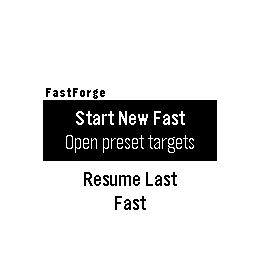
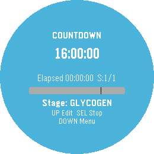
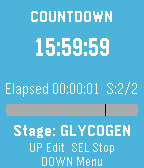

# FastForge

FastForge is a Pebble watchapp for intermittent fasting tracking, built with the Rebble SDK.

## Screenshots

| Pebble Round 2 — Menu | Pebble Round 2 — Countdown | Pebble Round 2 — History | Pebble Time — Countdown |
|:---:|:---:|:---:|:---:|
|  |  |  |  |

## Day-1 Setup (Fedora + Rebble SDK 4.9+)

```bash
sudo dnf update
sudo dnf install -y python3-pip nodejs SDL-devel dtc uv just
uv tool install pebble-tool --python 3.13
export PATH="$HOME/.local/bin:$PATH"
pebble sdk install latest
```

## After Reboot

```bash
export PATH="$HOME/.local/bin:$PATH"
pebble --version
```

## Development Workflow

```bash
cd /path/to/fastforge
export PATH="$HOME/.local/bin:$PATH"
just dev
```

In a second terminal:

```bash
cd /path/to/fastforge
export PATH="$HOME/.local/bin:$PATH"
just logs
```

Useful commands:

- `just`: list commands
- `just dev`: build + install to Pebble Round 2 (gabbro) emulator
- `just dev-basalt`: build + install to Pebble Time (basalt) emulator
- `just logs`: live logs from gabbro emulator
- `just screenshot`: screenshot from gabbro emulator
- `just kill`: stop emulator
- `just clean`: remove build artifacts
